# 20260120 Codex 上下文工程 & 源码解析

```mermaid
graph TD;
    node_0
    node_1
    node_2
    node_3
    node_4
    node_5
    node_6
    node_7
    node_8
    node_9
    node_10
    node_11
    node_12
    node_13
    node_14
    node_15
    node_16
    node_17
    node_18
    node_19
    node_20
    node_21
    node_22
    node_23
    node_24
    node_25
    node_26
    node_27
    node_28
    node_29
    node_30
    node_31
    node_32
    node_33
    node_34
    node_35
    node_36
    node_37
    node_38
    node_39
    node_40
    node_41
    node_42
    node_43
    node_44
    node_45
    node_46
    node_47
    node_48
    node_49
    node_50
    node_51{Tools Definition - 永不压缩}
    node_52{节点52}
    node_53{节点53}
    node_54{Header}
    node_55{节点55}
    node_56{节点56}
    node_57{Custom}
    node_58{节点58}
    node_59{节点59}
    node_60{AGENTS.md}
    node_61{节点61}
    node_62{节点62}
    node_63{节点63}
    node_64{ToolRegistry}
    node_65{节点65}
    node_66{BashTool}
    node_67{User Msg}
    node_68{节点68}
    node_69{节点69}
    node_70{Tool Input}
    node_71{节点71}
    node_72{Skill 输出}
    node_73{节点73}
    node_74{节点74}
    node_75{节点75}
    node_76{节点76}
    node_77{压缩规则说明}
    node_78{调用返回}
    node_10 --> node_51
    node_8 --> node_52
    node_8 --> node_53
    node_8 --> node_54
    node_15 --> node_55
    node_15 --> node_56
    node_15 --> node_57
    node_9 --> node_58
    node_9 --> node_59
    node_9 --> node_60
    node_18 --> node_61
    node_18 --> node_62
    node_18 --> node_63
    node_18 --> node_64
    node_10 --> node_65
    node_10 --> node_66
    node_20 --> node_67
    node_11 --> node_68
    node_11 --> node_69
    node_11 --> node_70
    node_28 --> node_71
    node_28 --> node_72
    node_30 --> node_73
    node_30 --> node_74
    node_35 --> node_75
    node_35 --> node_76
    node_24 --> node_77
    node_76 --> node_78
```

## 讨论记录 (weichao & ting 1.23)

思路：

1. skill + rules 按需加载
   - [agent-browser SKILL.md](https://github.com/vercel-labs/agent-browser/blob/main/skills/agent-browser/SKILL.md)
   - [vue-skills](https://github.com/hyf0/vue-skills/tree/master)
2. fewshot 司内还没有比较好的比如美团 context7，可以沉淀到 skill
