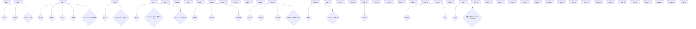

# 20260120 Gemini 上下文工程 & 源码解析

```mermaid
graph TD;
    node_0
    node_1
    node_2
    node_3
    node_4
    node_5
    node_6
    node_7
    node_8
    node_9
    node_10
    node_11
    node_12
    node_13
    node_14
    node_15
    node_16
    node_17
    node_18
    node_19
    node_20
    node_21
    node_22
    node_23
    node_24
    node_25
    node_26
    node_27
    node_28
    node_29
    node_30
    node_31
    node_32
    node_33
    node_34
    node_35
    node_36
    node_37
    node_38
    node_39
    node_40
    node_41
    node_42
    node_43
    node_44
    node_45
    node_46{节点46}
    node_47{节点47}
    node_48{Gemini 上下文}
    node_49{节点49}
    node_50{节点50}
    node_51{节点51}
    node_52{节点52}
    node_53{System Prompt - 永不压缩}
    node_54{节点54}
    node_55{Tools Definition - 永不压缩}
    node_56{节点56}
    node_57{Messages History - 部分可压缩}
    node_58{节点58}
    node_59{节点59}
    node_60{内置工具}
    node_61{节点61}
    node_62{节点62}
    node_63{节点63}
    node_64{调用后返回完整Skill指令}
    node_65{节点65}
    node_66{User Msg - 永不压缩}
    node_67{Tool Input - 永不压缩}
    node_68{节点68}
    node_69{Skill}
    node_70{节点70}
    node_71{完整Skill指令: instructions + resources}
    node_72{调用返回}
    node_1 --> node_46
    node_1 --> node_47
    node_1 --> node_48
    node_2 --> node_49
    node_2 --> node_50
    node_2 --> node_51
    node_2 --> node_52
    node_2 --> node_53
    node_3 --> node_54
    node_3 --> node_55
    node_4 --> node_56
    node_4 --> node_57
    node_9 --> node_58
    node_9 --> node_59
    node_9 --> node_60
    node_14 --> node_61
    node_14 --> node_62
    node_14 --> node_63
    node_14 --> node_64
    node_15 --> node_65
    node_15 --> node_66
    node_4 --> node_67
    node_25 --> node_68
    node_25 --> node_69
    node_27 --> node_70
    node_27 --> node_71
    node_19 --> node_72
```
