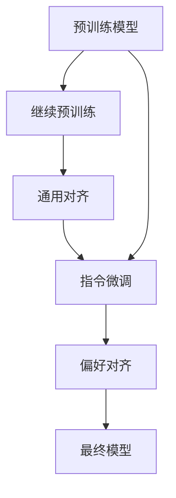

# LLM 基础知识简述 - 来自姚老师的入门指导

# 1、NLP 基本概念

NLP 的长期主线是：**表示（representation）** 与 **学习范式（learning paradigm）** 的演进。早期更多依赖规则和特征工程，**规则/词典驱动**；随后统计方法与大规模语料推动了概率模型；2010年代起深度学习（神经网络）主导，词向量让"分布式表示"成为主流；Seq2Seq 与注意力机制推动端到端任务；再到 Transformer 将序列建模核心转为自注意力，从而为之后的大语言模型奠定结构基础。

**数据与预处理**：原始文本通常要先清洗、再切分成模型可处理的最小单位（分词/tokenizer）。现代系统常用"子词/词片段"（subword），典型做法是 BPE（Byte Pair Encoding）及其变体，以及 SentencePiece。

**Token / 词表 / 嵌入（Embedding）**：
- Token：分词后的"积木块"，可能是字、词或子词。
- 词表（Vocabulary）：模型允许的 token 集合。
- 嵌入（Embedding）：把离散 token 映射为连续向量，便于神经网络计算。

**常见任务类型**：
- 分类：输入文本，输出类别（情感、主题等）。
- 序列标注：对每个 token 输出标签（词性标注、命名实体识别）。
- 生成：输出新文本（翻译、摘要、续写等）。

**评价指标**：
- Accuracy / Precision / Recall / F1：分类与序列标注常用
- BLEU：机器翻译常用，比较生成译文与参考译文的 n-gram 重合程度
- ROUGE：摘要常用，强调与参考摘要的重合（更偏"召回导向"）
- 困惑度（Perplexity）：语言模型常用，衡量模型对测试文本的预测能力（越低越好）

# 2、NLP 技术演进时间线

NLP 的主线技术大致经历了：**规则/词典驱动** → **统计学习** → **神经网络** → **Transformer + 预训练** → **大语言模型（LLM）**。

**规则/基于词典阶段（1950s–1980s）**：人工编写规则，依赖词典/知识库。典型里程碑是 1966 年的 ELIZA。

**统计学习阶段（1990s–2010s 初）**：
- 序列概率模型（如 HMM）
- 统计机器翻译（如 IBM Models）
- 判别式序列标注（CRF）

**神经网络阶段（2010s）**：
- 词向量（word2vec，2013）
- 序列到序列（seq2seq，2014）
- 注意力（attention，2014）

**预训练与 Transformer 阶段（2017–至今）**：Transformer 用"自注意力 + 前馈网络"替代循环结构。

# 3、Transformer 与预训练语言模型

## 3.1 Transformer 简述

Transformer 的核心部件是 **Self-Attention**：

1. 把每个 token 映射成三组向量（Q、K、V）
2. 用 Q 与 K 计算相关性并归一化成权重
3. 用权重对 V 加权求和，得到"融合上下文后的表示"

多头注意力（multi-head）相当于让模型用多组"视角"并行关注不同关系。

## 3.2 预训练语言模型

预训练语言模型（PLM）的关键思想是：先用海量 **无标注文本** 做自监督学习，让模型学到"语言结构与常识性统计规律"，再迁移到具体任务。

经典预训练目标三类：
- **自回归（Autoregressive）**：从左到右预测下一个 token，即目前 LLM 的结构
- **自编码/掩码（Masked LM）**：随机遮住部分 token，根据双向上下文预测回来（BERT 的 MLM）
- **混合/seq2seq 去噪（Denoising）**：先"破坏"输入，再让模型重建原文（T5、BART）

## 3.3 预训练语言模型与大语言模型

目前常说的大语言模型（LLM）就是 PLM 中以"自回归"为预训练目标的模型，结构常为 decoder-only。

| 模型名 | 预训练目标 | 发布年份 | 参数量 | 主要创新 |
| --- | --- | --- | --- | --- |
| BERT | Masked LM | 2018 | 110M/340M | MLM + NSP；双向 Transformer Encoder |
| GPT-3 | Autoregressive | 2020 | 175B | 大规模自回归预训练；in-context learning |
| PaLM | seq2seq | 2022 | 540B | Pathways 系统支持超大规模训练 |
| InstructGPT | Autoregressive | 2022 | 1.3B/6B/175B | SFT → 偏好建模 → RLHF |
| LLaMA | Autoregressive | 2023 | 7B–65B | 公开数据训练与高效实现 |
| Llama 2 | Autoregressive | 2023 | 7B–70B | 系统化对话后训练与更长上下文 |
| Qwen2.5 | Autoregressive | 2024 | 多档 | 预训练与后训练系统升级 |
| DeepSeek-V3 | Autoregressive | 2024 | 671B(MoE)/37B(激活) | MoE + 新注意力/路由策略 |

# 4、大语言模型训练方法

主流方式为"预训练 → 适配 → 对齐"的标准工程流程。

## 训练全流程

1. **预训练（Pre-training）**：在海量通用文本上学通用语言能力。主流开源大模型为 Qwen、DeepSeek、GLM。
2. **继续预训练（CPT）**（非必需）：构建垂类领域数据集，在开源大模型继续预训练，注入领域知识。
3. **通用对齐**（非必需）：用通用方法和数据训练模型的指令遵循能力。
4. **指令微调（SFT）**（常用）：用高质量指令-答案数据集，加强模型对指令遵循或目标业务场景的理解能力。
5. **偏好对齐（RLHF 或 DPO 等）**：用偏好数据让模型输出更符合规则的偏好。用途包括：调整语言风格、增加推理能力、增强泛化性。
6. **知识检索（RAG）**：模型下游应用，解决知识不足或动态更新问题。

